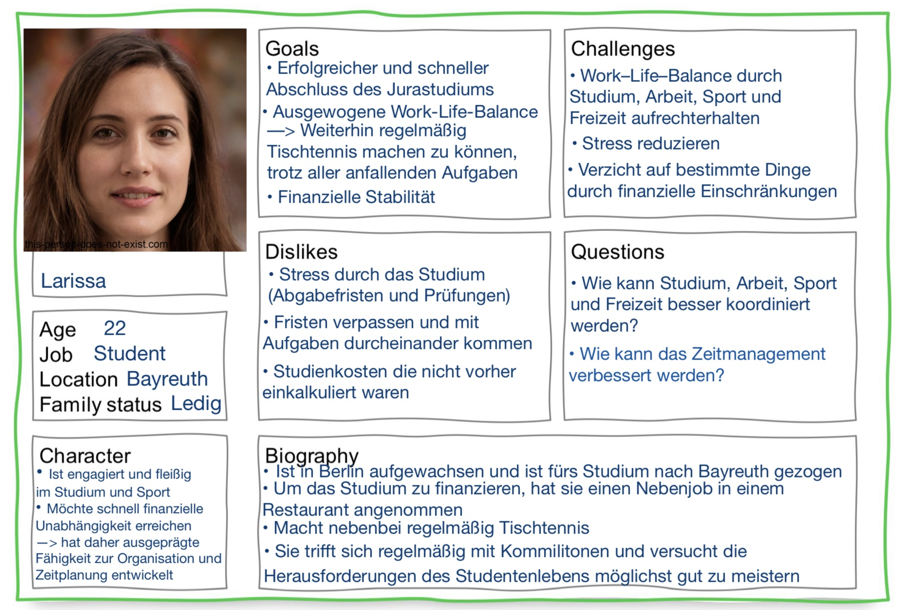

Katharina Chroszczinsky
{: .label }

# Value proposition and more
{: .no_toc }

  

    Table of contents
  

  {: .text-delta }
- TOC
{:toc}

## Value proposition 

*Maximaler Nutzen, minimaler Aufwand* - Die To-do-App für jeden.
 Egal ob jung, alt, technisch begabt oder doch eher handwerklich angelehnt. Diese Anwendung bietet die ideale Lösung für jeden, der mühelos den Überblick behalten will. So leicht war Organisation noch nie!

Mit dieser To-do-Webseite können Nutzer einfach und unkompliziert den Überblick über ihre anstehenden Aufgaben behalten. Jeder Mensch hat eine Vielzahl von Aufgaben, die in den verschiedenen Lebensbereichen anfallen. Dabei kann es schwer sein, alles im Blick zu behalten..

Die App ist benutzerfreundlich aufbereitet und Aufgaben können leicht verwaltet werden. Daten können flexibel und unkompliziert verändert oder erstellt werden und durch die Speicherung der Daten in Echtzeit geht nichts verloren. Durch einen eigenen Useraccount, kann man sich von verschiedenen Devices auf der Website anmelden und hat so immer seine eigenen Listen und Aufgaben zur Verfügung!

Dem Benutzer wird ein einmaliges Erlebnis gegeben, einfach und schnell organisiert zu sein. Egal in welcher Lebenssituation, dank der To-do App kann das Leben ein Stück leichter gemacht werden!

---

## Persona

Bildquelle
: https://this-person-does-not-exist.com/en/download-page?image=gen11c7b13443c99dcf2492301db448464d

---

## Features aligned with value proposition and persona

**Benutzerfreundlichkeit:** 
Die To-Do App ist leicht zu bedienen und hat eine intuitive Benutzeroberfläche. Es erfordert nicht viel können oder Einarbeitungszeit, die Applikation in seinem vollen Umfang benutzen zu können. Da Larissa nicht viel mit Technik am Hut hat, ist die App für sie genau richtig, weil man zur Bedienung nicht viel technisches Wissen benötig.

**Aufgabenverwaltung:**
Die Webanwendung ermöglicht eine effektive Strukturierung von verschiedenen anfallenden Angelegenheiten. Durch die Option zur Erstellung von benutzerdefinierten Listen, können anfallende Aufgaben in Kategorien zusammengestellt werden. So kann Larissa besser die Übersicht behalten, indem sie beispielsweise Listen für die Kategorien Studium, Sport, Arbeit und Freizeit erstellt.

**Flexibilität:**
Da sich anfallende Aufgaben immer verändern oder auch neu hinzukommen, bietet die Anwendung einfach und schnell die Möglichkeit, seine erstellten Listen und zu erledigenden Aufgaben zu bearbeiten, erweitern oder zu löschen. Larissa kann so also die Anwendung an ihre individuellen Bedürfnisse anpassen und sich selbstständig organisieren.

**Echtzeit Synchronisation:**
Nachdem Larissa eine Aufgabe erledigt hat, wünscht sie sich die Möglichkeit, unmittelbar festzuhalten, was sie von ihrer Liste streichen kann. Es ist ihr dann von Bedeutung, dass diese Information sofort und in Echtzeit ohne Verzögerung festgehalten wird. Die ToDo-App bietet eine Echtzeit Synchronisation, so dass ohne Zeitverzögerungen und Datenverlust die vorgenommenen Änderungen sichtbar sind. Dadurch ist sie immer auf dem neuesten Stand. 

**Eigener Useraccount:**
Dank eines eigenen Useraccounts, werden die eingegeben Aufgaben für den jeweiligen User gespeichert. So sind die Daten sicher verwaltet und nur von den Personen zugänglich, die sie erstellt haben. Nach einmaliger Registrierung kann Larissa sich also auch auf dem Rechner in der Uni oder bei Freunden zu Hause ihre anfallenden Aufgaben anschauen und bearbeiten.

